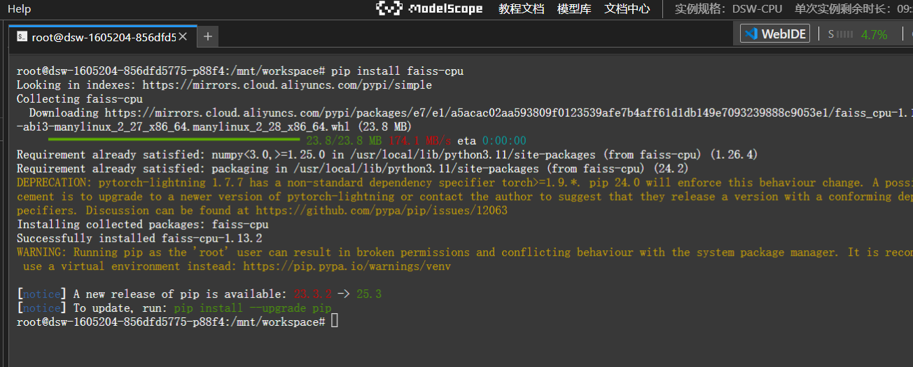
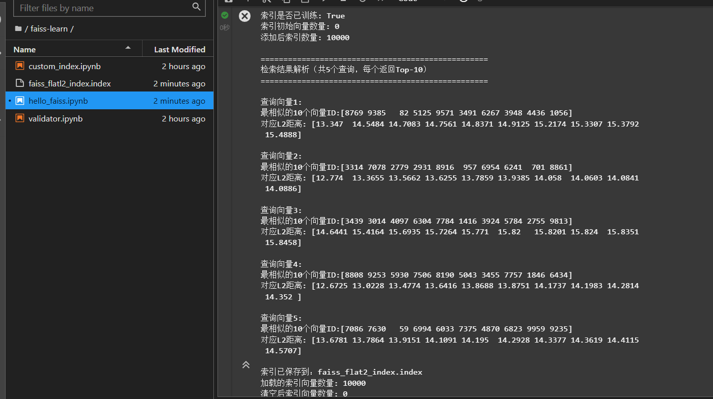

## Faiss入门与环境搭建

Faiss, Meta AI团队研发的开源向量相似性搜索库。专门用于解决大规模高维向量的快速检索问题，通过高效的算法实现向量之间相似性的计算与匹配，为人工智能应用中的语义检索、图像检索等场景提供支撑。

核心优势：
- 高效性
- 算法丰富
- 硬件适配好
- 易用性
- 可扩展性


### Faiss与Milvus/Chroma的对比

- Faiss
 - 本质定位: 向量检索库（偏算法实现）
 - 核心优势：算法性能强，GPU加速优，适合大规模数据。
 - 部署复杂度：简单，库级调用，无需单独部署服务
 - 适用场景：大规模向量检索任务、算法研究、AI系统底层检索模块
 - 生态集成：需自行集成存储、服务化组件
- Milvus
 - 本质定位：企业级向量数据库，完整数据库特性
 - 核心优势：支持分布式部署、高可用、事务，生态完善
 - 部署复杂度：中等，支持单机/分布式，需配置集群。
 - 适用场景：企业级应用、高并发检索服务、数据量激增的业务场景
 - 生态集成：支持与Spark、Flink、Langchain等主流工具集成
- Chorma
 - 本质定位：轻量级向量数据库，面向开发者快速上手
 - 核心优势：安装简单，API极简，适合快速原型开发
 - 部署复杂度：极其简单，单机部署，开箱即用
 - 适用场景：小规模数据检索、快速开发测试、个人项目
 - 生态集成：深度适配LangChain，适合LLM应用开发。

### Faiss的适用场景

- 大规模向量检索：向量数据达到百万、千万甚至数十亿级别时，Faiss的近似检索算法能博爱正一定精度的前提下，实现高效检索。如：电商平台商品图片的相似推荐、短视频平台的内容查重。
- 低延迟检索需求：对检索响应速度要求高的实时应用，如智能客服的语义问答、自动驾驶中的环境感知。
- AI领域核心支撑
 - 计算机视觉：图像检索、人脸识别、目标跟踪
 - 自然语言处理：语义检索、文本相似度计算、问答系统
 - 多模态检索：跨文本、图像、音频相似性匹配。
- 算法研究与原型开发：基于Faiss快速验证向量检索算法的效果，借助其简洁API快速搭建检索模块原型，降低开发成本。

**注意**：Faiss是“向量数据库”而非完整的“数据库“，不具备传统数据库的事务、权限管理等特性，若需企业级高可用服务，需结合Milvus等数据库产品使用。

### Faiss环境搭建

#### 依赖
- Python 3.6+
- CMake 3.13+ 
- GCC 5.4+
- OpenBLS: 开源线性带束裤，用于CPU上的向量计算加速，是Faiss CPU版本的核心依赖。
- CUDA Toolkit: NVIDIA的CUDA Toolkit，用于GPU加速。
- Numpy
- Pillow, 可选图像特征提取。

### 使用ModelScope的CPU环境

https://modelscope.cn/my/mynotebook


#### 安装命令

```bash
# 安装CPU版本FAISS 
pip install faiss-cpu

```



**验证安装**

```python
import faiss
import numpy as np

# 验证FAISS版本
print("FAISS版本：", faiss.__version__)

# 验证向量检索功能
# 1. 生成测试向量（100个128维向量）
dimension = 128  # 向量维度
num_vectors = 100  # 向量数量
vectors = np.random.random((num_vectors, dimension)).astype('float32')  # FAISS默认使用float32类型

# 2. 创建索引（精确检索）
index = faiss.IndexFlatL2(dimension)  # L2距离（欧氏距离）索引
print("索引是否为空：", index.is_trained)  # 输出True表示索引可使用

# 3. 添加向量到索引
index.add(vectors)
print("索引中的向量数量：", index.ntotal)  # 输出100

# 4. 生成查询向量并检索
query_vector = np.random.random((1, dimension)).astype('float32')
k = 5  # 返回Top-5相似结果
distances, indices = index.search(query_vector, k)

# 5. 输出结果
print("查询结果距离（L2）：", distances)
print("查询结果索引：", indices)

```


### Faiss数据结构

- Index: 索引类是Faiss中最核心的数据结构。所有向量的存储、检索操作都依赖于Index类及其派生类。

#### 基类Index的核心作用（基础API）

- add(x): 将向量数据x添加到索引中，x的形状为(num_vectors, dimension), 数据类型为float32。
- search(x, k): 在索引中检索与x最相似的k个向量，返回数组(distances)和索引数组(indices)
- reset(): 清空索引中的所有向量数据，重置索引状态
- save(filename)/load(filename): 将索引保存到磁盘或从磁盘加载索引。
- is_trained: 属性，返回布尔值，表示索引是否已”训练“完成。
- ntotal: 索引中向量的数量。

#### 常见派生类

**精准检索**
- IndexFlat2
  - 基于L2（欧式距离）计算相似度，无近似误差，检索速度较慢，无需训练
  - 适用场景：小规模数据（万级以下）、对精度极高的场景。
- IndexFlatIP
  - 基于内积（Inner Product）计算相似度，适用于归一化向量的余弦相似度检索
  - 适用场景：文本语义检索（向量已归一化）、特征匹配

**近似检索**
- IndexIVFFlat
  - 基于倒排文件（Inverted File）结构，需先训练聚类中心，检索速度快，精度可调节。
  - 适用场景：中大规模数据（百万级）、平衡速度与精度的场景。
- IndexIVFPQ
  - 在IndexIVF基础上添加乘积量化（PQ）压缩，大幅减少内存占用，支持十亿级数据。
  - 适用场景：超大规模数据（十亿级）、内存有限的场景。
- IndexHNSWFlat
  - 基于层次化近似最近邻（HNSW）算法，检索速度极快，内存占用较高。
  - 适用场景：对检索延迟要求极高的实时场景。

### 向量存储基础：数据格式与维度约束

#### 数据格式

- 数据类型：FAISS仅支持32位浮点数（float32）作为向量数据类型，不支持其他格式。
- 数据结构：输入向量需为二维向量，形状为（num_vectors, dimension），其中num_vectors为向量数量，dimension为单个向量的维度（所有向量维度必须一致）。
- 数据来源适配：
  - Numpy数组：可直接使用, add()方法添加。
  - PyTorch/TensorFlow张量：需转换为Numpy数组后, 再转换为float32类型。
  - Python列表：需先通过np.array()转换为Numpy数组，再处理类型和形状。

#### 维度约束

- 维度一致性： FAISS的索引对象在创建时会固定向量维度（由构造函数的参数指定），后续添加的向量必须与该维度一致。


### ID映射机制：向量与自定义ID的关联

- 默认情况下，FAISS为添加到索引的向量分配自增的整数ID（从0开始），实际应用中，可以自定义。

#### IndexIDMap的使用
- IndexIDMap: 通过ID映射机制，将向量与自定义ID关联起来，方便后续查询。

```python
import faiss
import numpy as np

dimension = 128
num_vectors = 100

# 1. 生成向量和自定义ID（例如图片ID：10001~10100）
vectors = np.random.random((num_vectors, dimension)).astype('float32')
custom_ids = np.arange(10001, 10001 + num_vectors).astype('int64')  # 自定义ID需为int64类型

# 2. 创建基础索引，并使用IndexIDMap包装
base_index = faiss.IndexFlatL2(dimension)
index = faiss.IndexIDMap(base_index)  # 包装后支持自定义ID

# 3. 添加向量时指定自定义ID（add_with_ids方法）
index.add_with_ids(vectors, custom_ids)
print("索引中的向量数量：", index.ntotal)

# 4. 检索时返回的是自定义ID
query_vector = np.random.random((1, dimension)).astype('float32')
k = 5
distances, indices = index.search(query_vector, k)

print("查询结果自定义ID：", indices)  # 输出10001~10100范围内的ID
print("查询结果距离：", distances)
```

**注意事项**
- 自定义ID类型：必须为int64类型，否则会导致ID映射错误。
- ID唯一性：添加的自定义ID需唯一，若重复添加相同ID，后续添加的向量会覆盖之前的向量。
- 索引操作兼容性：包装后的IndexIDMap支持基础索引的所有方法（如search、reset），但部分近似索引（如IndexIVFPQ）需先训练基础索引，再进行包装和添加ID。


### Faiss示例：随机向量精确检索
- 串联Faiss核心操作：向量生成、索引创建、向量添加、检索、结果解析
- 基础API使用方法。

```python
"""
FAISS基础示例：随机向量精确检索（IndexFlatL2）
流程：生成数据 → 创建索引 → 添加向量 → 执行检索 → 解析结果
"""
import faiss
import numpy as np

# -------------------------- 1. 配置参数与生成数据 --------------------------
# 向量配置
dimension = 128  # 向量维度（模拟图像/文本特征向量）
db_size = 10000  # 数据库向量数量（1万个）
query_size = 5  # 查询向量数量（5个）
k = 10  # 每个查询返回Top-10相似结果

# 生成数据库向量（float32类型，形状：(db_size, dimension)）
np.random.seed(42)  # 固定随机种子，保证结果可复现
db_vectors = np.random.random((db_size, dimension)).astype('float32')

# 生成查询向量（形状：(query_size, dimension)）
query_vectors = np.random.random((query_size, dimension)).astype('float32')

# -------------------------- 2. 创建索引 --------------------------
# 使用IndexFlatL2（基于L2距离的精确检索索引）
# 构造函数参数：向量维度
index = faiss.IndexFlatL2(dimension)

# 查看索引状态（是否已训练，FAISS中精确索引无需训练，默认is_trained=True）
print("索引是否已训练：", index.is_trained)  # 输出：True
print("索引初始向量数量：", index.ntotal)  # 输出：0（未添加向量）

# -------------------------- 3. 向索引添加向量 --------------------------
# 使用add()方法添加数据库向量
index.add(db_vectors)

# 查看添加后的索引状态
print("添加后索引向量数量：", index.ntotal)  # 输出：10000

# -------------------------- 4. 执行检索 --------------------------
# 使用search()方法执行检索，参数：查询向量、返回结果数
distances, indices = index.search(query_vectors, k)

# -------------------------- 5. 解析检索结果 --------------------------
print("\n" + "="*50)
print("检索结果解析（共{}个查询，每个返回Top-{}）".format(query_size, k))
print("="*50)

for i in range(query_size):
    print("\n查询向量{}:".format(i+1))
    print("  最相似的{}个向量ID：{}".format(k, indices[i]))
    print("  对应的L2距离：{}".format(np.round(distances[i], 4)))  # 保留4位小数

# -------------------------- 6. 索引的其他常用操作 --------------------------
# 1. 保存索引到磁盘
faiss.write_index(index, "faiss_flatl2_index.index")
print("\n索引已保存到：faiss_flatl2_index.index")

# 2. 从磁盘加载索引
loaded_index = faiss.read_index("faiss_flatl2_index.index")
print("加载的索引向量数量：", loaded_index.ntotal)  # 输出：10000

# 3. 清空索引
loaded_index.reset()
print("清空后索引向量数量：", loaded_index.ntotal)  # 输出：0

```




### 总结

- Faiss：大规模向量检索数据库，偏向算法实现，非完整数据库，存储需结合Milvus等自行集成。
- Faiss核心数据结构：Index及其派生类，支持精确检索和近似检索。
- Faiss自定义ID映射：通过IndexIDMap实现，支持自定义向量ID。


### 参考文档

[FAISS入门与安装教程](https://datawhalechina.github.io/easy-vectordb/Faiss/chapter1/FAISS%E5%85%A5%E9%97%A8%E4%B8%8E%E7%8E%AF%E5%A2%83%E6%90%AD%E5%BB%BA.html)


