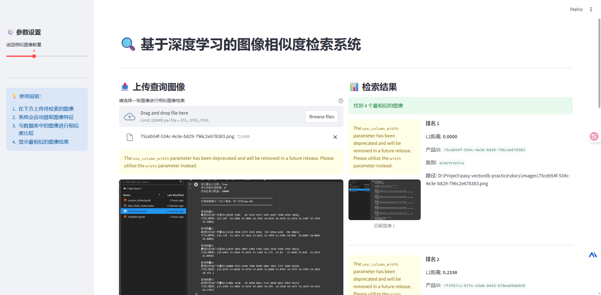

## Faiss工程化落地实践

### Faiss文本语义检索实战

```bash
# 虚拟环境创建（conda示例）
conda create -n faiss-env python=3.10 -y
conda activate faiss-env

# 核心依赖安装
pip install faiss-cpu  # CPU版本，GPU版本需安装faiss-gpu
pip install sentence-transformers  # 文本嵌入模型库
pip install fastapi uvicorn  # API开发框架
pip install numpy pydantic  # 数据处理与校验
pip install modelscope #魔塔社区库

```

#### 任务目标
基于某门课程的PPT文本或课件资料，构建课程问答检索系统，实现"输入问题返回相关课程内容"的功能。

#### 实施步骤
数据准备：将课程资料按段落拆分，整理为"text+metadata"格式（metadata包含章节、页码等信息）；
向量生成：使用本小节5.1.2的方法生成所有段落的嵌入向量；
检索库构建：通过FAISS创建索引并保存，确保元数据与向量一一对应；
接口优化：在FastAPI接口中增加文本长度校验、结果排序优化；
系统测试：设计10个课程相关问题，测试检索结果的准确率，调整top_k参数优化体验。

#### 学习检验
完成后需提交：1. 数据预处理代码；2. 检索库构建脚本；3. API服务代码；4. 测试报告（含问题、结果及准确率分析）。


[实战源码：文本语义检索实战](..\faiss-libai-demo\ReadMe.md)


**示例**

[文本语义检索示例](..\faiss-libai-demo\90a960da-898e-42fc-85e0-581c2f9bbb98.png)


### Faiss图像检索实战

```bash
conda activate faiss-env
uv pip install torch torchvision  # 深度学习框架
uv pip install pillow opencv-python  # 图像处理库
```

#### 任务目标
构建一个论坛图片相似检索系统，支持输入一张论坛图片图像，返回数据库中视觉特征最相似的论坛图片信息。

#### 实施步骤
数据准备：收集不同类别的论坛图片图像；
特征提取：使用ResNet50模型提取所有论坛图片图像的特征向量，确保向量归一化；
检索库构建：训练FAISS IndexIVFFlat索引并保存，元数据包含论坛图片类别、价格（模拟）、图像路径；
交互功能开发：基于Streamlit开发简单前端界面，支持图像上传与检索结果展示；
系统优化：测试不同nprobe值对检索精度和速度的影响，确定最优参数。
前端界面可以借助AI大模型帮忙生成


[实战源码：图片检索实战](..\faiss-pic-demo\ReadMe.md)


**示例**：



### 工程化部署注意事项

Faiss检索系统从开发环境中走向生产环境，需解决索引更新、性能监控、容错处理三大核心问题。

#### 索引增量更新策略

**1、小规模增量：直接添加向量**

适用于每次新增向量数量较少（万级以内）的场景，直接在原有索引上添加新向量，无需重新训练。

```python
import faiss
import numpy as np

# 加载原有索引
index = faiss.read_index("./text_search_db/faiss_index.index")

# 模拟新增数据的向量（实际中从新文本/图像提取）
new_embeddings = np.random.random((100, 1024)).astype(np.float32)  # 新增100个向量

# 直接添加到索引
index.add(new_embeddings)
print(f"增量更新后向量总数：{index.ntotal}")

# 保存更新后的索引（建议先备份旧索引）
faiss.write_index(index, "./text_search_db/faiss_index_updated.index")
```

**2.大规模增量：索引合并**

当新增向量数量达到原有规模的50%以上时，建议单独构建新索引，再与旧索引合并，提升检索效率。

```python
import faiss

# 1. 加载旧索引和新构建的增量索引
old_index = faiss.read_index("./old_index.index")
new_index = faiss.read_index("./new_index.index")  # 基于新增数据构建的索引

# 2. 合并索引（需确保两个索引类型一致）
merged_index = faiss.IndexFlatIP(old_index.d)  # 与原索引维度一致
merged_index.add(old_index.reconstruct_n(0, old_index.ntotal))  # 读取旧索引所有向量
merged_index.add(new_index.reconstruct_n(0, new_index.ntotal))  # 读取新索引所有向量

# 3. 保存合并后的索引
faiss.write_index(merged_index, "./merged_index.index")
```

**增量更新注意事项**
- IVF类索引增量添加向量后，检索精度可能下降，可定期（如每周）重新训练索引；
- 更新时需加锁机制，避免检索服务读取残缺索引；
- 元数据需与向量同步更新，建议使用数据库存储元数据，通过向量索引关联ID查询。

#### 接口性能监控（QPS/延迟）

**1.指标采集：Prometheus+FastAPI**

```bash
# 安装依赖
pip install prometheus-fastapi-instrumentator==6.1.0 prometheus-client==0.20.0
from fastapi import FastAPI
from prometheus_fastapi_instrumentator import Instrumentator

app = FastAPI()

# 初始化监控器
instrumentator = Instrumentator(
    should_group_status_codes=False,
    should_ignore_untemplated=True,
    should_respect_env_var=True,
    should_instrument_requests_inprogress=True,
    excluded_handlers=["/health"]  # 排除健康检查接口
)
instrumentator.instrument(app).expose(app, endpoint="/metrics", include_in_schema=False)

# 后续添加检索接口...

# 启动服务后，访问http://localhost:8000/metrics即可获取指标数据
```

**2.监控指标核心关注项**
- http_requests_total：API请求总数。无固定值，结合业务峰值设置
- http_request_duration_seconds：API请求延迟。重点关注P95 < 500ms
- process_cpu_usage: CPU使用率，< 80%
- process_memory_usage_bytes: 内存占用，根据索引大小调整，无内存泄漏

**性能优化方向**
- 索引优化： 大规模数据使用HNSW索引（兼顾速度与精度），如IndexHNSWFlat.
- 缓存机制： 对高频查询结果使用Redis缓存，减少重复查询检索计算。
- 分布式部署: 使用Faiss的分布式索引，实现负载均衡
- 模型优化： 使用轻量化模型（如Sentence-BERT的mini版本、MobileNet替代ResNet）降低特征提取耗时。

#### 容错处理

**1、索引损坏应对策略**
- 定期备份：使用定时任务（如crontab）每日备份索引文件，保留近7天的备份版本
- 校验机制：加载索引时校验索引完整性，捕获faiss.Error异常并自动切换至备份索引

**2.向量缺失与元数据不一致处理**
- 数据校验：构建检索库时，确保向量数量与元数据数量严格一致，添加校验步骤
- 异常捕获：检索时若索引返回的Indices超出元数据范围，返回友好错误提示并记录日志。

**3.服务高可用保障**
- 进程守护：使用SuperVisor或systmd管理API服务，确保服务异常退出后自动重启
- 日志记录：使用logging模块记录详细日志(请求参数、响应结果、错误堆栈)，便于问题排查。
- 降级策略：当服务负载过高时，自动降级为”只返回缓存结果“或”减少top_k数量“，保证核心功能


### 总结

- 对文本向量化检索和图片向量化检索的工程化有了进一步的认识，能够实现一个可运行的文本或者图片检索系统了。
- 对于工程化部署等待实践中检验完善。
- 对于现有的文本检索或图片检索，再细化看看细节，根据二、三章节实践去探索更多实践使用问题。


### 参考文档

[Faiss工程化落地实战](https://github.com/datawhalechina/easy-vecdb/blob/main/docs/Faiss/chapter5/FAISS%E5%B7%A5%E7%A8%8B%E5%8C%96%E8%90%BD%E5%9C%B0%E5%AE%9E%E6%88%98.md)

