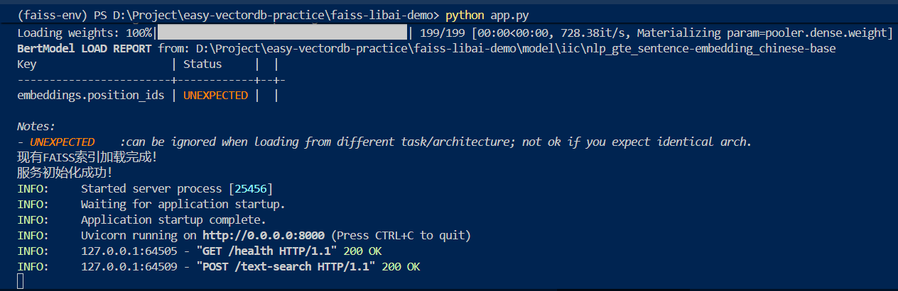
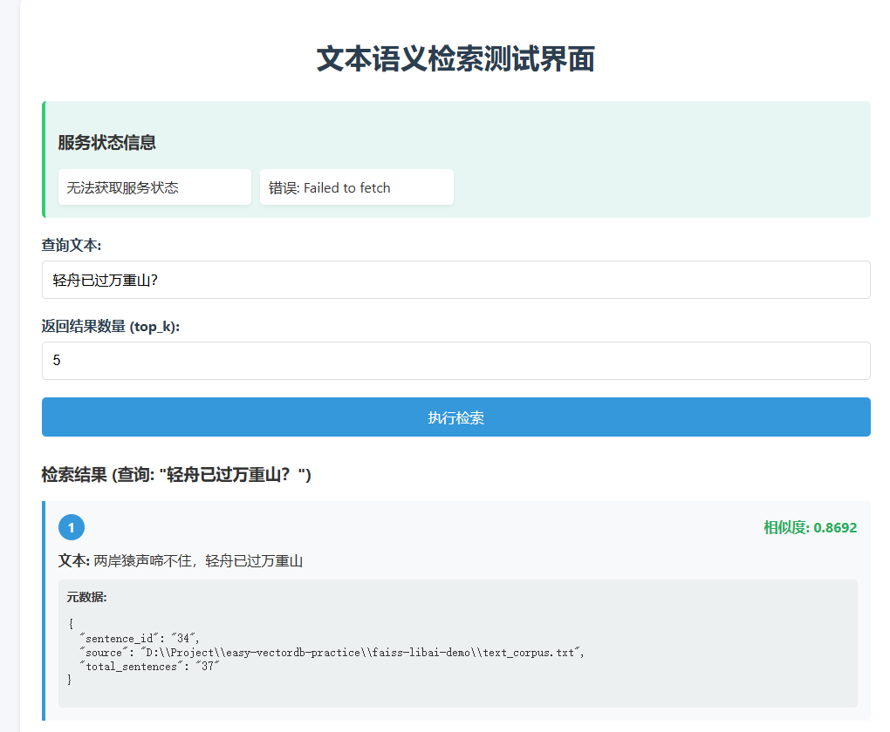

## 通过Python文件+requirements

### 概述
这是传统的独立部署方式，将FastAPI服务部署为独立的Python应用程序，通过requirements.txt管理依赖。

### 文件结构
```
faiss-libai-demo/
├── app.py                 # FastAPI主应用
├── test_client.py         # 客户端测试脚本
├── requirements.txt       # 依赖管理文件
└── text_search_db/        # 存储向量索引和元数据
    ├── faiss_index.index
    └── metadata.json
```

### 实现步骤

1. **安装依赖**
   ```bash
   cd faiss-libai-demo
   conda create -n faiss-env python=3.10
   conda activate faiss-env
   pip install uvicorn[standard]>=0.24.0
   uv pip install -r requirements.txt
   ```

2. **启动服务**
   ```bash
   cd faiss-libai-demo
   python app.py
   ```
   或者
   ```bash
   cd faiss-libai-demo
   uvicorn app:app --host 0.0.0.0 --port 8000
   ```




3. **测试服务**
   ```bash
   python test_client.py
   ```


4. **HTML方式访问**



### requirements.txt内容
```
fastapi==0.104.1
uvicorn[standard]>=0.24.0
faiss-cpu>=1.9.0
sentence-transformers>=2.2.0
pydantic>=2.0.0
modelscope>=1.9.0
requests>=2.28.0
```

### 优点
- 独立部署，易于维护
- 性能稳定，适合生产环境
- 支持多进程部署
- 便于容器化部署

### 缺点
- 需要额外管理多个文件
- 依赖安装可能较复杂
- 需要手动启动服务

---